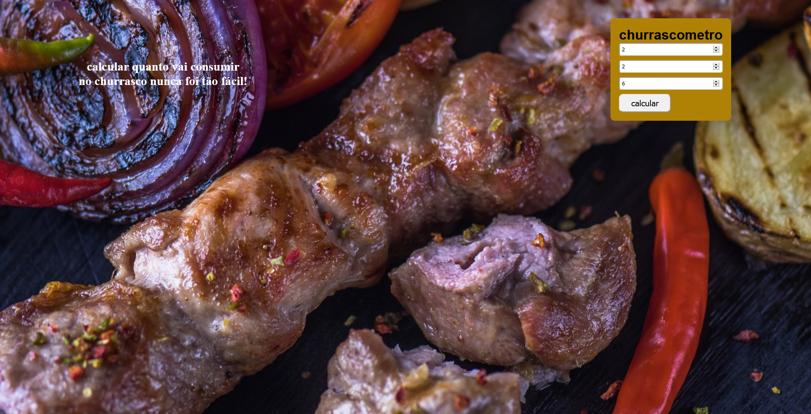
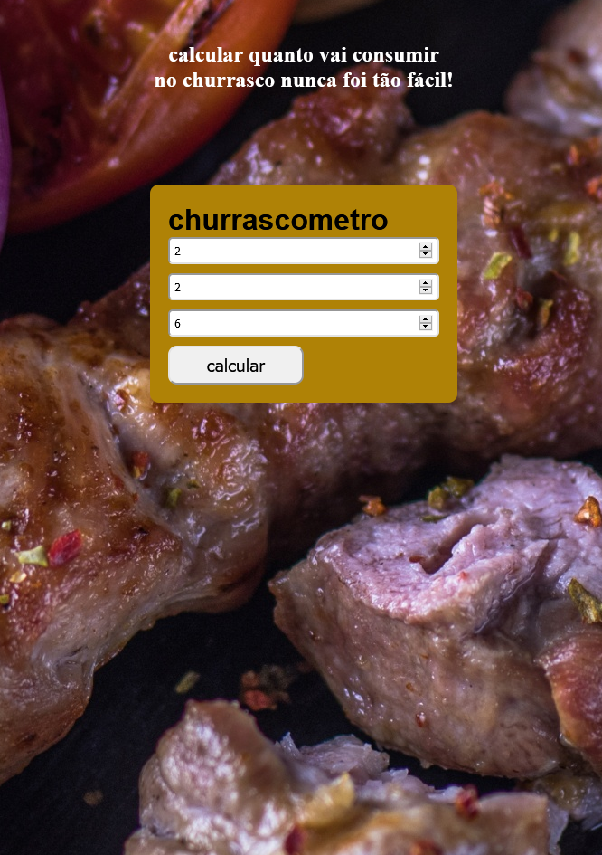
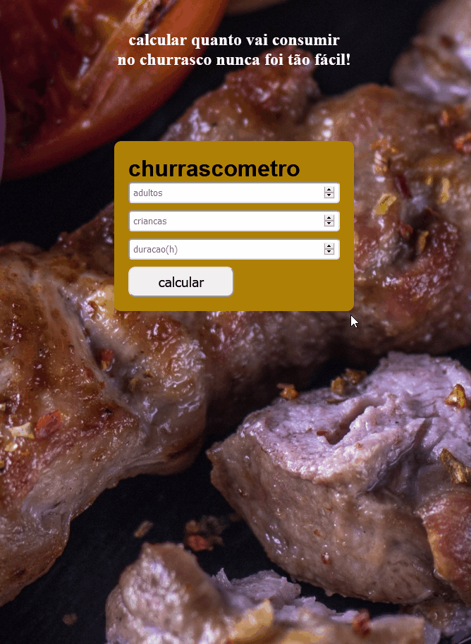

# churrascometro

<a href="https://vilmar-moreira-souza.github.io/churrasco/" target="blank">visualizar</a>
<h2>desktop</h2>

<h2>mobile</h2>

 

<h3>sobre a aplicação</h3>

essa aplicação é um pagina onde é possivel calcular quanto de alimento(carne) e bebidas vai ser necessario para o churrasco, sendo necessario informar o numero de pessoas e duração. 

 <a href="https://vilmar-moreira-souza.github.io/churrasco/" target="blank">visualizar </a>
 

<h3>ideias para implementar</h3>

 <li>melhorar o design</li>
<li> adicionar imagens e icones com melhores resoluçoes e formatos mais adequados</li>
<li> adicionar mais funçoes de calculo</li>
<li> adicionar dicas para o churrasco</li>
<li> mais...</li>

<h3>bugs e problemas</h3>

<li>melhorar css- deixar codigo mais enxuto  </li>
<li> mais...</li>